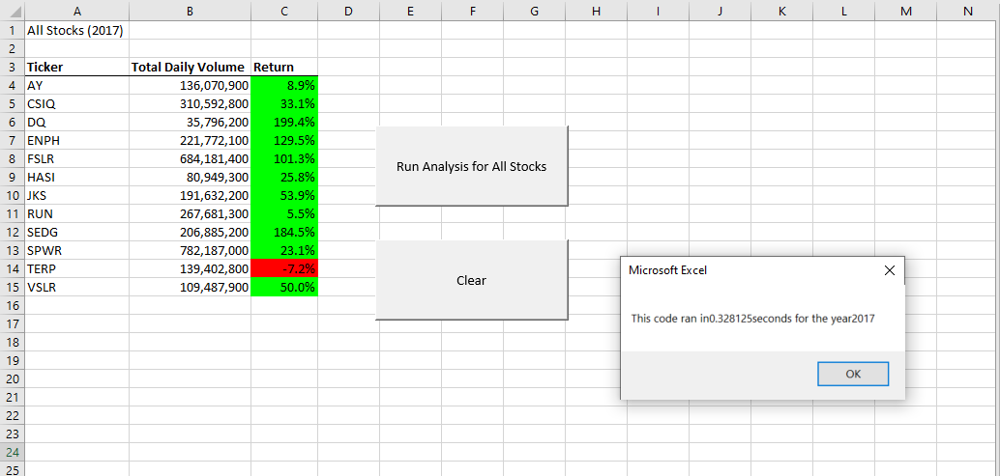
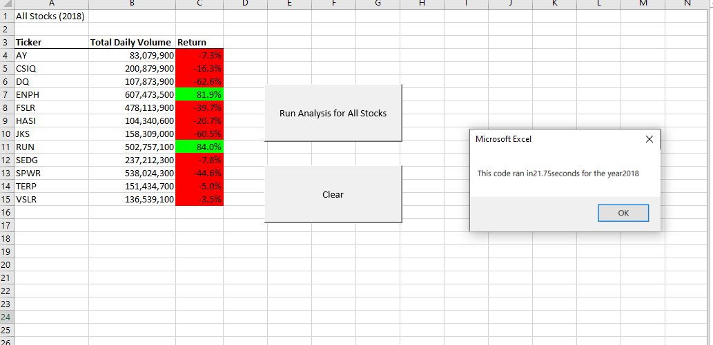

# Module2-Challenge
Excel - VBA

# Overview of Project: Explain the purpose of this analysis
The purpose of this analysis is to refractor the Module2 solution code and create a more efficient method for analyzing large datasets, stocks specifically. After refractoring the code to achieve the same end goals we need to determine whether or not the refactored code was more efficient aka did the code run quicker after. 

## Results: Using images and examples of your code, compare the stock performance between 2017 and 2018, as well as the execution times of the original script and the refactored script.
When looking at the side by side comparison of the refractored code results of stock data from 2017 and 2018 one can see that overall 2017 outperformed 2018 in Returns.  

# What are the advantages or disadvantages of refactoring code?

# How do these pros and cons apply to refactoring the original VBA script?
