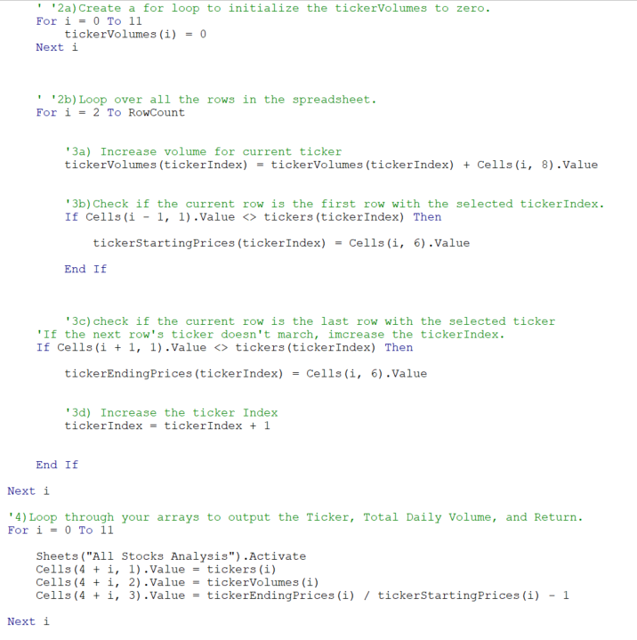

# Module2-Challenge
Excel - VBA

# Overview of Project: Explain the purpose of this analysis
The purpose of this analysis is to refractor the Module2 solution code and create a more efficient method for analyzing large datasets, stocks specifically. After refactoring the code to achieve the same end goals we need to determine whether or not the refactored code was more efficient aka did the code run quicker after. 

## Results: Using images and examples of your code, compare the stock performance between 2017 and 2018, as well as the execution times of the original script and the refactored script.
When looking at the side-by-side comparison (see image below) of the refactored code results of stock data from 2017 and 2018 one can see that overall 2017 outperformed 2018 in returns. When taking a deeper dive into the data, we see that although almost every stock's return went down RUN's increased dramatically and ENPH remained above 80% whereas the rest experienced losses instead. Another insight we can draw from the data comparison is that although TERP experienced loss in both years, it's amount of loss decreased in 2018 while maintaining a lower total daily volume than most other stocks.  

I ran into glitches after creating the "for loop" in the original script and noticed something was incorrect in the code running through the "Return" array as the returns were all appearing to be "0.0%". Whenever I attempted to edit the code my VBA and excel windows would stop responding and I would need to restart the program. This happened every time (over separate days of attempts) so I was not able to fix the original script. My refactored code on the contrary I was able to loop through all 3 arrays.  This presumably had an effect on the execution times. However, I believe that given that the 2017 data appeared to run faster with the refactored code than the original script it would have been the case for both if the original script had been able to have been edited correctly. I also noticed that 2018 had longer execution times which I believe could be due to the negative calculations taking more time to execute over positive ones since there were many more loses in 2018 than 2017. 

# What are the advantages or disadvantages of refactoring code?
In summation, there are many advantages of refactoring code the first being it allows the coder to be creative in inventing new ways to find solutions to a problem while simultaneously allowing for more than one script to solve the problem at hand. This allows for code that is easier to digest compared to other scripts. Additionally, it creates efficient solutions to allow codes to run more swiftly and in less time which was demonstrated in this Module2-Challenge. Moreover, it helps feed collaboration of improvement and individuality of thought process on how one goes about the code. We saw this exemplified in class during the "FizzBuzz" class exercise. The disadvantage is it can be risky when one does not understand the code they are working with and can ruin an original script (if it had not been saved properly) and if it is a very large script. 

# How do these pros and cons apply to refactoring the original VBA script?
In the case of this Module2-Challenge the refactoring process demonstrated more pros than cons. This script was not very large so that was one risk we didn't face in this case. Refactoring allowed for efficiency in run time and code that, in my case, I was able to edit and portray the data correctly. It demonstrated that we were able to use the data to give us a clearer and more efficient visual to see and be able to present to others.
